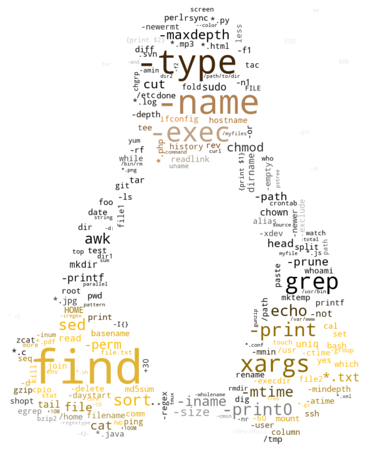
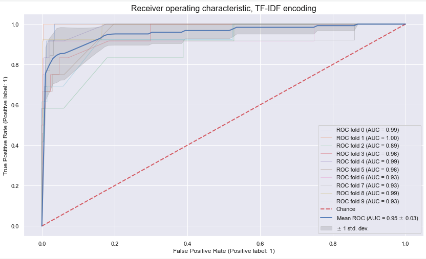

# Shell Language Processing (SLP)

SLP provides a tokenization and encoder classes for parsing of Unix/Linux shell commands, so raw commands (e.g. from `auditd` logs or bash history) can be used for Machine Learning purposes.

:warning: This is Proof-of-Concept (PoC) realization, pre-alpha software.

<p align="center">


# Evaluation

We performed evaluation of tokenization quality in comparison with alternatives from NLTK's *WordPunctTokenizer* and *WhiteSpaceTokenizer*, which known to be used in industry for IT log parsing.

Results:

Tokenizer | F1 | Precision | Recall | AUC 
--- | --- | --- | --- | ---
*SLP (ours)* | **0.874** | 0.980 | **0.789** | **0.994** 
*WordPunct* | 0.392 | **1.0** | 0.244 | 0.988
*WhiteSpace* | 0.164 | **1.0** | 0.089 | 0.942

Assessment done on the security classification problem, where we train an ML model to distinguish malicious command samples from benign activity. 

Legitimate commands `data/nl2bash.cm` consist of [nl2bash](https://arxiv.org/abs/1802.08979) dataset. Original data can be found [here](https://github.com/TellinaTool/nl2bash).

Malicious examples `data/malicious.cm` were collected from various Penetration Testing resources and scripts, some examples:

- [Reverse Shell Cheat Sheet](https://github.com/swisskyrepo/PayloadsAllTheThings/blob/master/Methodology%20and%20Resources/Reverse%20Shell%20Cheatsheet.md)
- [LinEnum.sh Script](https://github.com/rebootuser/LinEnum/blob/master/LinEnum.sh)
- [Linux Privilege Escalation Guide](https://blog.g0tmi1k.com/2011/08/basic-linux-privilege-escalation/)

All commands are normalized: domain names are replaced by *example.com* and all IP addresses with *1.1.1.1*, sot the evaluation focuses on the command syntactic structure. For practical realisations we suggest to perform similar normalization, to avoid overfitting to a specific hostnames or addresses. Maliciousness checks of IP addresses or hostnames can be performed separately in a manual manner using something like [GreyNoise API](https://github.com/GreyNoise-Intelligence/api.greynoise.io). 

For classification we train a gradient boosting ensemble of decision trees, with the specific realization from [XGBoost](https://xgboost.readthedocs.io/en/latest/).

Experiments can be observed or replicated in [this notebook](https://github.com/dtrizna/slp/blob/main/examples/security_classification.ipynb).

# Citation

If you are inspired, and you develop these ideas further or use parts of code in your own research, please cite us:

```
@misc{trizna2021shell,
      title={Shell Language Processing: Unix command parsing for Machine Learning}, 
      author={Dmitrijs Trizna},
      year={2021},
      eprint={2107.02438},
      archivePrefix={arXiv},
      primaryClass={cs.LG}
}
```

# Example usage

## Code sample:

```python
from slp import ShellTokenizer, ShellEncoder

with open("commands.txt") as file:
    data = file.readlines()

tokenizer = ShellTokenizer()
command_corpus, command_counter = tokenizer.tokenize(data)
print(command_counter.most_common(5))
"""
[('find', 7846),
('|', 6487),
('.', 3775),
('-name', 3616),
('-type', 3403)]
"""
    
encoder = ShellEncoder(command_corpus, command_counter, top_tokens=500, verbose=False)
X_tfidf = encoder.tfidf()
# shape: (commands, top_tokens)
print(X_tfidf.shape)
pprint(X_tfidf.toarray()[:5,:])
"""
(100, 500)
array([[0.15437351, 0.09073   , 0.        , ..., 0.        , 0.        ,
        0.        ],
       [0.05145784, 0.06048667, 0.2277968 , ..., 0.        , 0.        ,
        0.        ],
       [0.03704964, 0.0435504 , 0.16401369, ..., 0.        , 0.        ,
        0.        ],
       [0.        , 0.36292   , 0.        , ..., 0.        , 0.        ,
        0.        ],
       [0.18524821, 0.217752  , 0.        , ..., 0.        , 0.        ,
        0.        ]])
"""
```

At this point data is ready to be supplied as input for your ML model:

```python
mymodel.fit(X_tfidf, y)
```

## Execute within a Docker :whale: environment

SLP is available via the [Docker Hub](https://hub.docker.com/repository/docker/dtrizna/slp). 

Evaluate your code from within docker container as follows:

```
% docker run -it -d dtrizna/slp bash
% CONTAINER=$(docker ps | grep slp | awk '{print $1}')
% docker cp /local/path/to/code.py $CONTAINER:/code.py
% docker exec -ti $CONTAINER python /code.py

    [[0.20273255 0.20273255 0.         ...         0.        ]
    [0.         ...         0.13515504 0.13515504 0.13515504]]
 ```

# Additional notes

- Tokenization heavily depends on [bashlex](https://github.com/idank/bashlex) library, but implements additional wrapping for problematic cases.

- Some ideas of exploratory data analysis, visualiations and examples can be found under `/eda/` and under `/examples/`:


